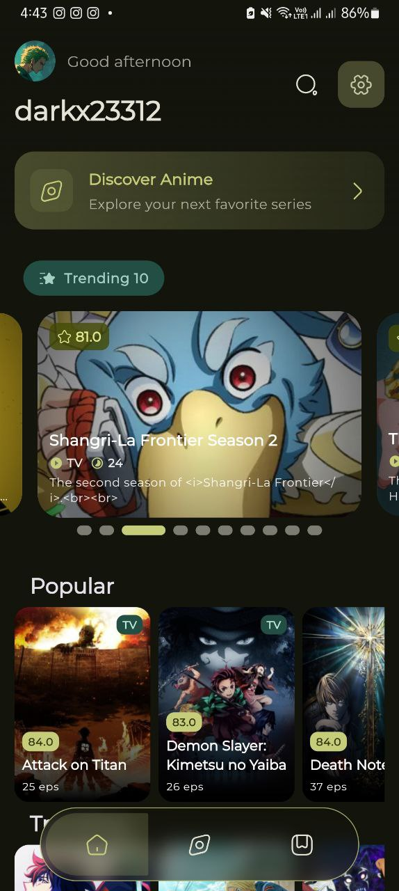
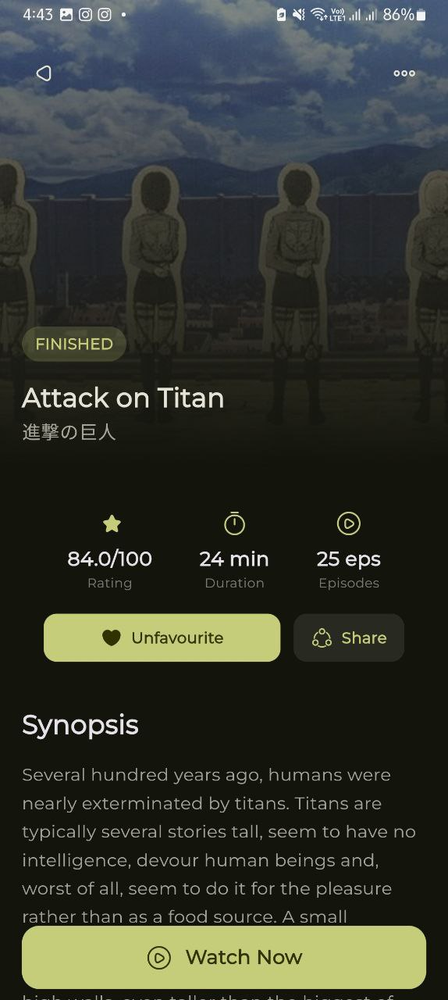
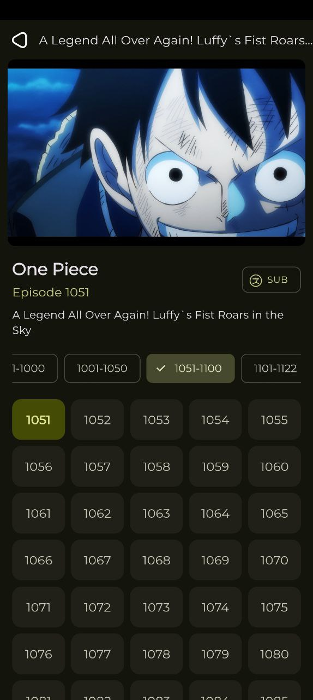
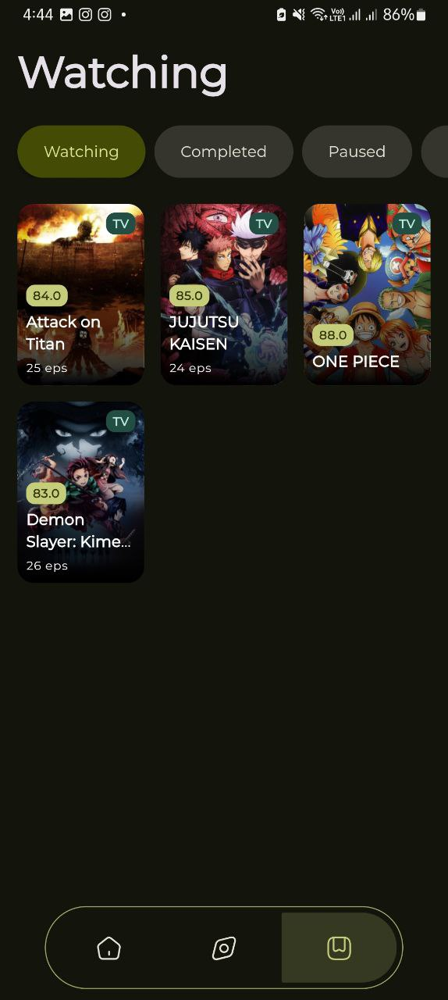
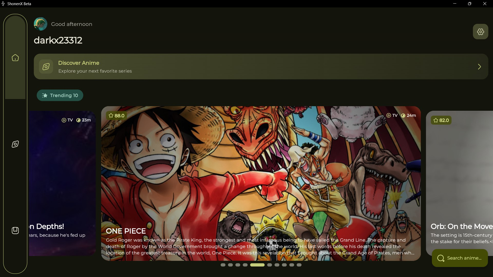
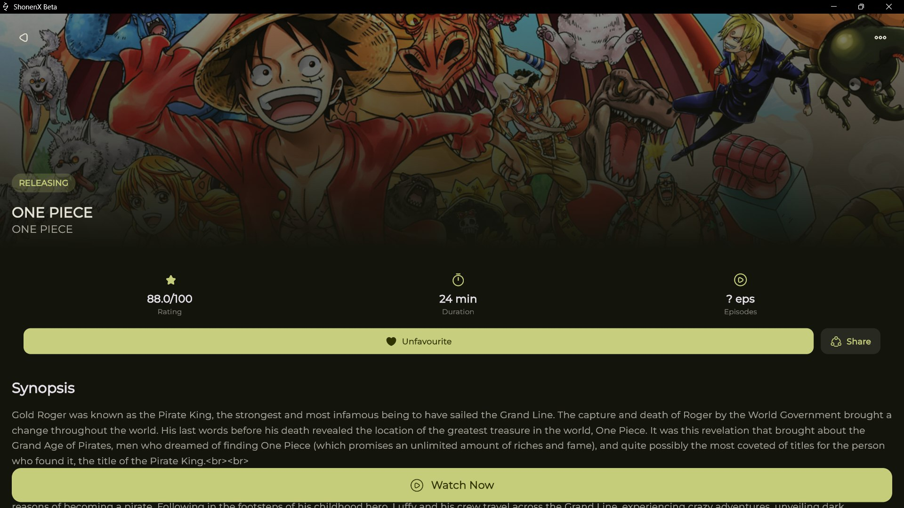
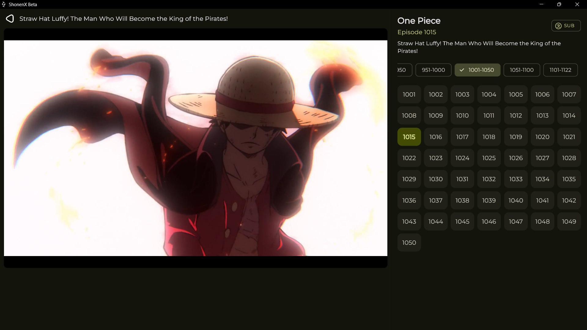
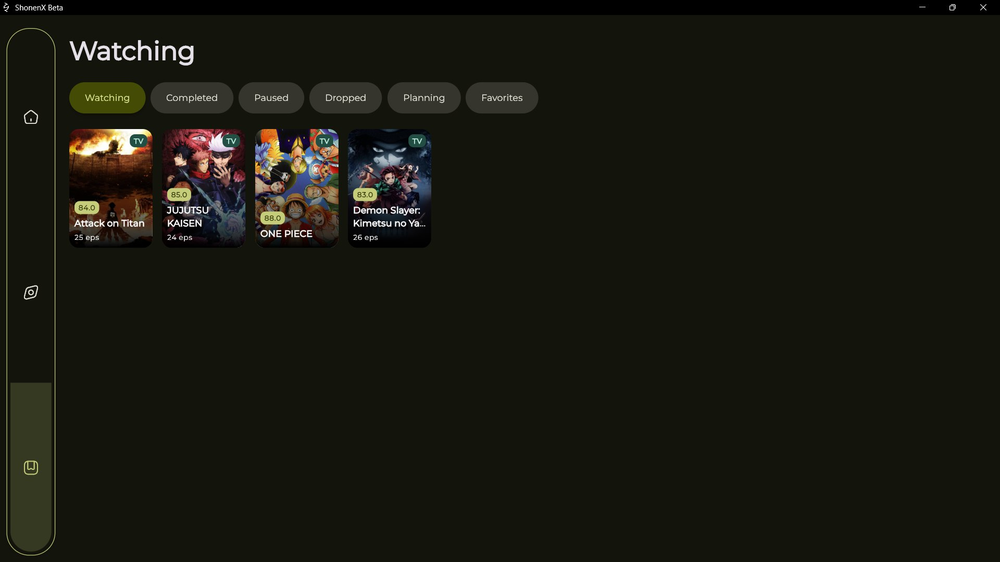

<div align="center">
   
  
# ShonenX

[](https://flutter.dev/)
[](https://dart.dev)
[](https://opensource.org/licenses/MIT)
[](https://github.com/Darkx-dev/ShonenX/stargazers)


A modern, feature-rich anime streaming application built with Flutter, offering a seamless experience across mobile and desktop platforms.


🚧 **Revamp In Progress**  
I'm currently working on a major revamp to improve the app's design, functionality, and overall experience. Stay tuned for updates!

[Features](#-features) • [Screenshots](#-screenshots) • [Installation](#-installation) • [Contributing](#-contributing) • [Support](#-support)

</div>

## ✨ Features

### Core Features
- 🎯 **Intuitive Interface** - Material 3 design with smooth animations and transitions
- 📺 **Advanced Video Player** - Built with MediaKit for superior performance
- 🌐 **Cross-Platform** - Seamless experience on both mobile and desktop
- 🔄 **Offline Support** - Download and watch anime without internet (Pending)
- 🎨 **Theme System** - Dynamic color theming with light/dark mode support (Ultra theme system very soon)

### Streaming Features
- 📊 **Multiple Quality Options** - From 360p to 1080p
- 🎯 **Subtitle Selection** - Select desired subtitle
- ⏯️ **Remember Position** - Resume from where you left off (Pending)
- 📝 **Episode Tracking** - Keep track of watched episodes (Pending)

### User Features
- 🔍 **Advanced Search** - Find anime by title, genre, or season (pending genre & season)
- 📌 **Watchlist Management** - Organize your favorite shows (Only anilist and favorite toggle for now)
- 📱 **Responsive Design** - Optimized for all screen sizes

## 📸 Screenshots

### 📱 Mobile Views
<div align="center">
<table>
  <tr>
    <td></td>
    <td></td>
    <td></td>
    <td></td>
  </tr>
</table>

<details>
<summary>🖥️ Desktop Views</summary>

### Desktop Views
<table>
  <tr>
    <td></td>
    <td></td>
  </tr>
  <tr>
    <td></td>
    <td></td>
  </tr>
</table>
</details>
</div>

## 🛠️ Technology Stack

### Core Technologies
- **Framework**: Flutter (≥3.2.6)
- **Language**: Dart (≥3.2.6)
- **State Management**: Flutter Riverpod
- **Local Storage**: Hive
- **Video Player**: MediaKit
- **Navigation**: Go Router
- **API Integration**: GraphQL

### Key Dependencies
```yaml
dependencies:
  flutter_riverpod: ^2.6.1
  go_router: ^14.7.1
  hive_flutter: ^1.1.0
  media_kit: ^1.1.10+1
  graphql_flutter: ^5.2.0
  google_fonts: ^6.2.1
  cached_network_image: ^3.4.1
  flutter_staggered_animations: ^1.1.1
```

## 🚀 Installation

### Prerequisites
- Flutter SDK (≥3.2.6)
- Dart SDK (≥3.2.6)
- Android Studio / VS Code
- Git

### Setup Steps

1. **Clone the Repository**
```bash
git clone https://github.com/Darkx-dev/ShonenX.git
cd ShonenX
```

2. **Install Dependencies**
```bash
flutter pub get
```

3. **Run Code Generation**
```bash
flutter pub run build_runner build --delete-conflicting-outputs
```

4. **Run the Application**
```bash
# For debug mode
flutter run

# For release mode
flutter run --release
```

### Building for Production

#### Android
```bash
flutter build apk --release
```

#### Windows
```bash
flutter build windows --release
```

## 💡 Usage Guide

### Initial Setup
1. Launch ShonenX
2. Grant necessary permissions
3. Choose your preferred theme
4. Optional: Log in to sync your watchlist

### Basic Features
- Browse anime from the home screen
- Search for specific titles
- Add shows to your watchlist
- Download episodes for offline viewing

### Player Controls
- Double-tap to seek
- Swipe for volume/brightness
- Long press for playback speed
- Pinch to zoom (mobile)

## 🤝 Contributing

We welcome contributions! Here's how you can help:

### Development Process
1. Fork the repository
2. Create your feature branch (`git checkout -b feature/amazing-feature`)
3. Commit your changes (`git commit -m 'Add amazing feature'`)
4. Push to the branch (`git push origin feature/amazing-feature`)
5. Open a Pull Request

### Contribution Guidelines
- Follow Flutter/Dart style guidelines
- Write meaningful commit messages
- Add tests for new features
- Update documentation as needed

## 📄 License

This project is licensed under the MIT License - see the [LICENSE](LICENSE) file for details.

## 🙏 Acknowledgments

- [MediaKit](https://github.com/media-kit/media-kit) for the video player
- [Consumet API](https://github.com/consumet/api.consumet.org) for anime data
- Flutter team for the amazing framework

## 📞 Support

### Contact Information
- **Developer**: Roshan Kumar
- **GitHub**: [@Darkx-dev](https://github.com/Darkx-dev)
- **Email**: [darkx.dev.23@gmail.com](mailto:darkx.dev.23@gmail.com)

---

<div align="center">
  
### Star the repo if you like what you see! ⭐

Made with ❤️ by [Darkx-dev](https://github.com/Darkx-dev)
</div>