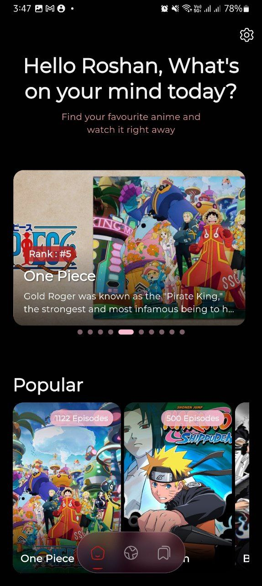
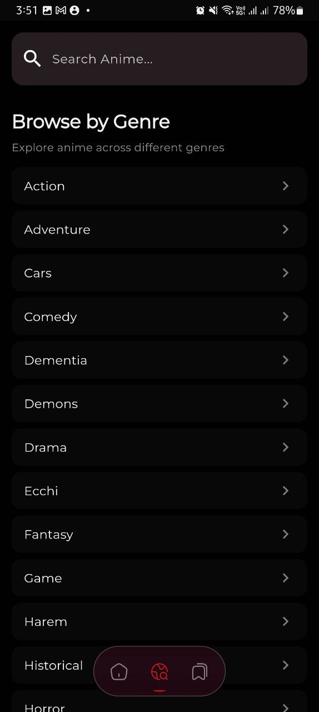
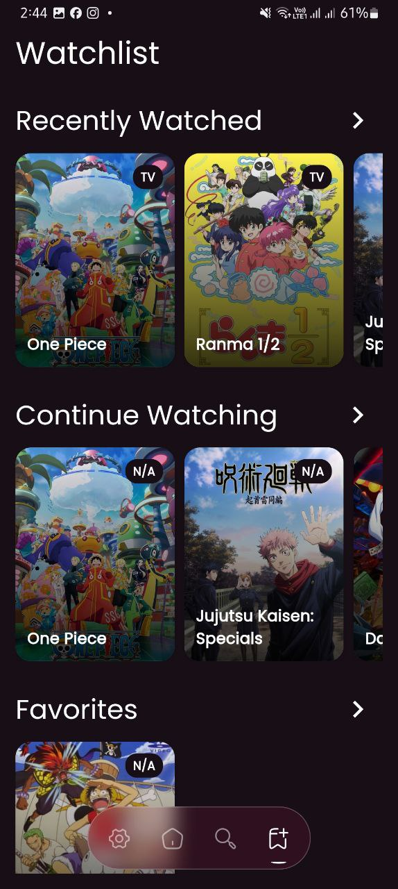
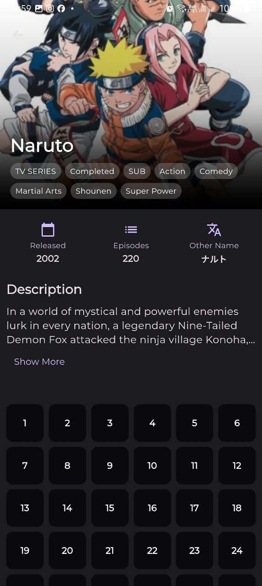
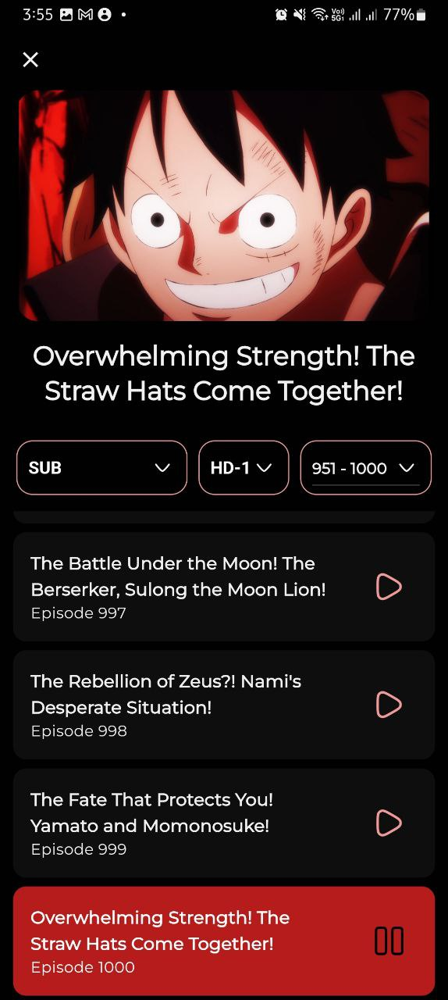
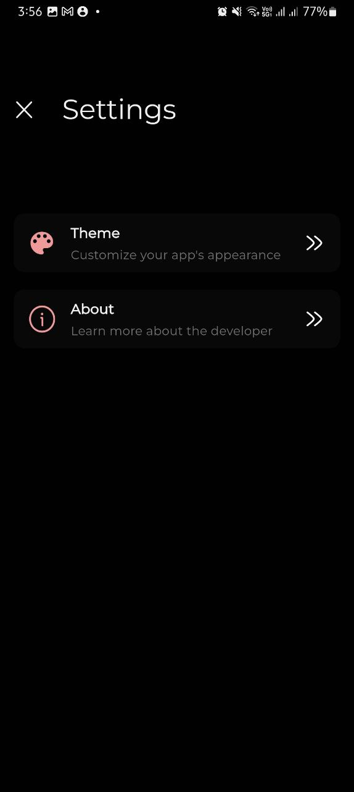
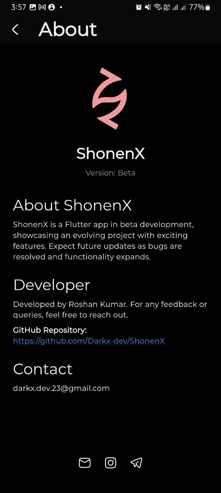

<div align="center">
   
  
  # ShonenX
  
  [](https://flutter.dev/)
  [](https://opensource.org/licenses/MIT)
  [](https://github.com/Darkx-dev/ShonenX/pulls)

A modern, feature-rich anime streaming application built with Flutter

</div>

## ✨ Features

- 🎯 **Intuitive Interface** - Clean and user-friendly design for seamless navigation
- 📺 **High-Quality Streaming** - Multiple quality options from 320p to 1080p
- 🌓 **Theme Customization** - Toggle between light and dark themes
- 📱 **Adaptive Layout** - Configurable player orientation for optimal viewing
- 🔍 **Search** - Find anime by title
- 📌 **Watchlist** - Keep track of your favorite shows

## 📸 Screenshots

<div align="center">
<table>
  <tr>
    <td></td>
    <td></td>
    <td></td>
    <td></td>
  </tr>
  <tr>
    <td></td>
    <td></td>
    <td></td>
    <td></td>
  </tr>
</table>
</div>

## 🛠️ Tech Stack

### Core

- **Framework**: Flutter (≥3.3.4)
- **Language**: Dart
- **State Management**: Hive flutter
- **Database**: Hive

### Key Dependencies

```yaml
dependencies:
  better_player: ^0.0.84
  crystal_navigation_bar: ^1.0.1
  flutter:
    sdk: flutter
  flutter_launcher_icons: ^0.14.1
  google_fonts: ^6.2.1
  hive: ^2.2.3
  hive_flutter: ^1.1.0
  http: ^1.2.2
  hugeicons: ^0.0.7
  shimmer: ^3.0.0
  url_launcher: ^6.3.1
dev_dependencies:
  flutter_test:
    sdk: flutter
  flutter_lints: ^5.0.0
  hive_generator: ^2.0.1
  build_runner: ^2.4.13
```

## 🚀 Getting Started

### Prerequisites

- Flutter SDK (≥3.3.4)
- Dart SDK
- Android Studio / VS Code
- Git

### Installation

1. **Clone the repository**

```bash
git clone https://github.com/Darkx-dev/ShonenX.git
cd ShonenX
```

2. **Install dependencies**

```bash
flutter pub get
```

3. **Run the app**

```bash
flutter run
```

### Configuration

1. **Build Configuration**
   - Modify `android/app/build.gradle` for Android settings
   - Update `ios/Runner.xcworkspace` for iOS settings

## 🎯 Usage Guide

### First-time Setup

1. Launch the app
2. Choose your preferred theme

### Watching Anime

1. Select an anime
2. Choose episode and quality settings
3. Enjoy streaming!

### Managing Watchlist

- Tap the favorite icon to add/remove shows
- Access your watchlist from the bottom navigator
- Auto add to recent/continue
- More features coming soon with development

## 🤝 Contributing

We welcome contributions! Here's how you can help:

1. **Fork the Repository**

   ```bash
   git clone https://github.com/your-username/ShonenX.git
   ```

2. **Create a Branch**

   ```bash
   git checkout -b feature/YourFeature
   ```

3. **Make Changes**

   - Write clean, documented code
   - Follow the project's coding style
   - Add tests if applicable

4. **Submit a Pull Request**
   - Describe your changes in detail
   - Link any related issues

### Development Guidelines

- Follow Flutter's style guide
- Write meaningful commit messages
- Update documentation as needed
- Add comments for complex logic

## 📄 License

This project is licensed under the MIT License - see the [LICENSE](LICENSE) file for details.

## 🙏 Acknowledgments

- Flutter team for the amazing framework
- [Aniwatch API](https://github.com/ghoshRitesh12/aniwatch-api) for anime data

## 📞 Contact & Support

- **Developer**: Roshan Kumar
- **GitHub**: [@Darkx-dev](https://github.com/Darkx-dev)
- **Email**: [darkx.dev.23@gmail.com](mailto:darkx.dev.23@gmail.com)

### Reporting Issues

- Use the GitHub issue tracker
- Include steps to reproduce
- Attach relevant screenshots/logs

---

<div align="center">
  Made with ❤️ by <a href="https://github.com/Darkx-dev">Darkx-dev</a>
</div>
